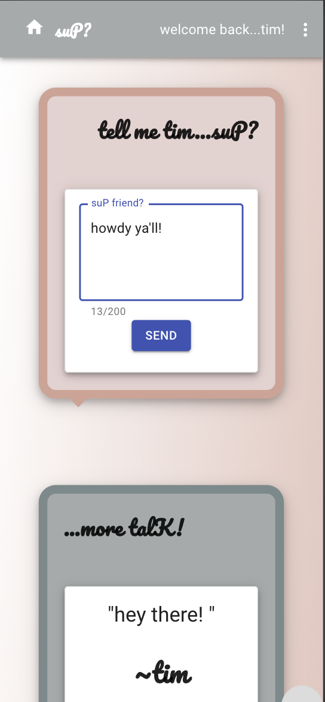
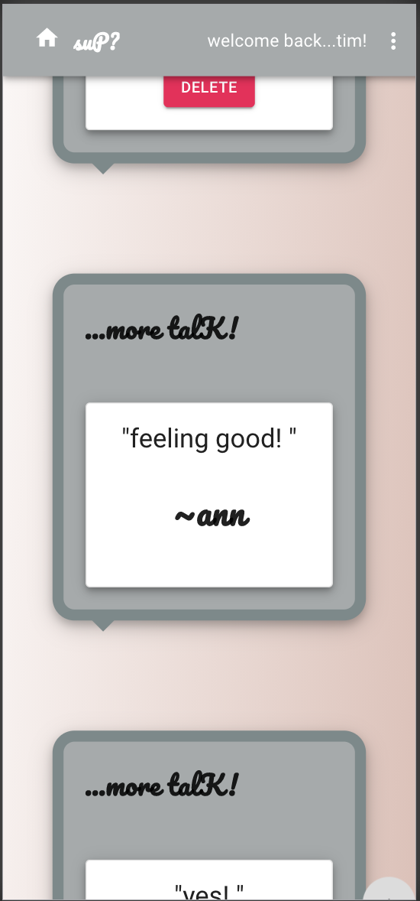
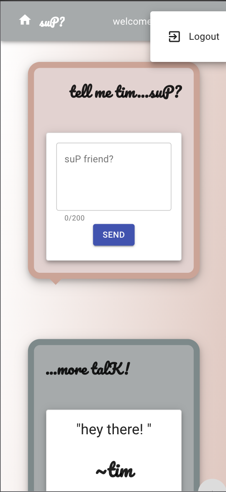
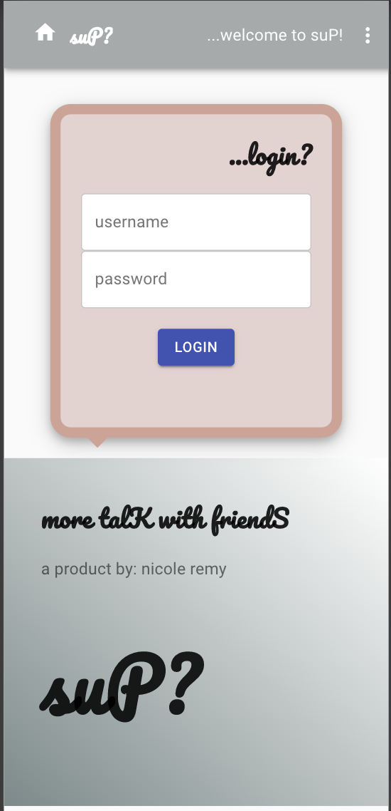

# Submission Requirements
## Project Description
suP? is a mobile responsive, newsfeed application for the modern chatter where more talk is encouraged! Quickly tell people ...suP? This application was built with MERN and Typescript. 

## User Story: 
The user can create an account, login, and make a "sup" in the news feed. From there the user can see other news in the news feed from other users. In addition, the user can update or delete their chat. 

## Architectural Overview: 
One to many relationship
Each User can have many "sup" News and each "sup" News has one User. 

## Data Models: 
    1) Users
    2) News(suP? news) 

## Components:
    *(components are capitalized and API calls are in parenthesis)

    1) App.tsx (getCurrentUser)
        A) Pages 
            i. Home (getCurrentUser)
                a. Scroll
                b. Sup (getCurrentUser, login, postNews) 
                c. News (getCurrentUser, updateNews, deleteNews)
            ii. Login
                a. LoginForm (login)
            iii. User
                a. UserComp (signUp)
        B) Components 
        C) AppBar (getCurrentUser) and Footer 

## High Level File Structure 
    1) client
        A) public
            i. index.html
        B) src
            i. components
                a. Appbar
                b. Footer
                c. LoginForm
                d. News
                e. Scroll
                f. Sup
                g. UserComp
            ii. pages
                a. Account 
                b. Home
                c. Login
                d. User 
            iii. utils
                a. API.tsx 
            iv. App.tsx
            v. Index.tsx
    2) server 
        A) models
            i. index.js (compiles information from items ii and iii)
            ii. news.js
            iii. user.js 
        B) app.js 

## Architectural Design Pattern 
 I used the MVC pattern for my project. The Model(M) are my models in the server-> models files. The Controller(C) are my routes, logic, data transformations, processing and API calls in the server-> app.js and client-> src-> utils-> API.tsx. The Views(V) are where all of my client/presentation side information in the client folders as components. 

## suP?

    The first page you come to as a user is the login page. At the top, the Appbar says "...welcome to suP!" indicating a new or not logged in user. For mobile view, the menu is displayed as a three dot dropdown to save space and be user intuitive. You can come back to the home page with the home icon or clicking on suP?

    After logging in, you are redirected to the main page where you can create a "sup" news. Sup is for quick remarks, therefore the features here include a max limit of 200 characters as well as a meter to show how many words you have left. Notice the Appbar at the top as well as the sup speech bubble both include the user's name to indicate they are logged in. The text box border also changes color and the title moves up to indicate the user is typing in the field. The text box also features "..." once clicked in the text box but before typing to guide the user to type. 

    After you create your suP?, the page refreshes so you can see it populate down below with the option to delete your suP? if you would like. *this option is only available if you created the suP?

    Here is an example of the newsfeed and notice that Tim is logged in therefore he can't delete Ann's news...this is a good thing. 

    Done talking for the day? Logout here! You can always come back!

# Project Requirements
## Modern JS Library/Framework 
    My project uses React.js.

## User Interaction
    ...A user can 
        1) create an account (POST ROUTE)
        2) login (POST ROUTE)
        3) logout (GET ROUTE)
        3) create "sup" news (POST ROUTE)
        4) delete "sup" news (DELETE ROUTE)
        5) read "sup" news (GET ROUTE)

## Architectural Pattern
    This project uses the MVC archiectural pattern. See Architectural Design Pattern above. 

## REST APIS
    This project uses these Rest API requests: 
        1. Get: users and news 
        2. Create: users and news
        3. Put: news
        4. Delete: news

## Material UI Components 
    This project uses these Material UI components:
        1. Appbar
        2. TextFields
        3. Icons 
        4. Styles (ex. makeStyles, Theme, createStyles)
        5. Core (ex. Typography, Container, Grid, Button)

## Reusable Components 
    *see below
    1. Footer
    2. LoginForm

